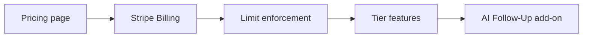

# GiveLive Pricing & Feature Roadmap

Track implementation status for plans, limits, billing, and the AI Follow-Up add-on.

**Legend:** ✅ Shipped · 🟡 Partial · 🔲 Planned · ⏸ Deferred

---

## Pricing tiers (marketing — live on `/pricing`)

| Plan | Price | Status |
|------|-------|--------|
| Free | $0/mo | 🔲 Limits not enforced |
| Starter | $19/mo | 🔲 Stripe Billing not wired |
| Growth | $49/mo | 🔲 Stripe Billing not wired |
| Pro | $99/mo | 🔲 Stripe Billing not wired |
| Enterprise | $299+/mo | 🔲 Sales-led / custom |
| AI Follow-Up Assistant | +$29/mo add-on | 🔲 Product not built |

Source of truth for copy: `client/src/data/pricingPlans.ts`

---

## Phase 1 — Pricing surface (current)

| Task | Status | Notes |
|------|--------|-------|
| Pricing page UI | ✅ | `/pricing` |
| Plan definitions in code | ✅ | `pricingPlans.ts` |
| Footer / nav links | ✅ | Home footer → Pricing |
| Implementation roadmap doc | ✅ | This file |

---

## Phase 2 — Billing foundation

| Task | Status | Notes |
|------|--------|-------|
| `organizations` + `subscriptions` schema | 🟡 | Auto-created on first billing API call |
| Map Clerk `userId` / `orgId` to GiveLive org | 🟡 | Billing uses `user.id`; flows still `default-org` |
| Stripe Billing products & prices | 🟡 | Run `setup-stripe-billing.ts` → env `STRIPE_PRICE_*` |
| Checkout / Customer Portal | ✅ | `/api/billing/checkout`, `/api/billing/portal` |
| Webhook: `customer.subscription.*` | ✅ | On `/api/donations/webhook` |
| Settings: current plan + manage billing | ✅ | Settings → Your GiveLive plan |
| Setup guide | ✅ | `docs/STRIPE_BILLING_SETUP.md` |

---

## Phase 3 — Plan limits (enforcement)

| Feature | Free | Starter | Growth | Pro | Enterprise | Built? |
|---------|------|---------|--------|-----|------------|--------|
| Active campaigns | 1 | 10 | ∞ | ∞ | ∞ | 🟡 Events exist, no cap |
| QR codes | 1 | ∞ | ∞ | ∞ | ∞ | 🟡 Per-event QR, no cap |
| Leads / month | 100 | 1,000 | 10,000 | 50,000 | ∞ | 🟡 Users captured, no monthly rollup |
| GiveLive branding | On | Off | Off | Off | Off | 🔲 |
| Analytics | Basic | Basic | Advanced | Advanced | Advanced | 🟡 Analytics page exists |
| Email notifications | — | ✅ | ✅ | ✅ | ✅ | 🟡 SMTP settings |
| CSV export | — | 🔲 | 🔲 | 🔲 | 🔲 | |
| CRM integrations | — | — | ✅ | ✅ | ✅ | ✅ Integration nodes |
| Email sequences | — | — | ✅ | ✅ | ✅ | ✅ Message nodes |
| Custom domains | — | — | 🔲 | 🔲 | 🔲 | |
| Team members | — | — | 3 | 10 | Custom | 🔲 |
| White-label | — | — | — | ✅ | ✅ | 🔲 |
| API access | — | — | — | ✅ | ✅ | 🟡 REST exists, no API keys |
| Outbound webhooks | — | — | — | ✅ | ✅ | 🟡 Inbound only (Meta/TikTok) |
| Priority support | — | — | — | ✅ | ✅ | 🔲 |
| SSO | — | — | — | — | ✅ | 🔲 |
| SLA | — | — | — | — | ✅ | 🔲 |

**Enforcement tasks**

- [ ] Monthly lead counter per `org_id` (cron or rolling 30-day window)
- [ ] Block new campaign creation when at cap
- [ ] Block publish when over lead cap (soft warning → hard block)
- [ ] Feature flags middleware reading `subscription.plan`

---

## Phase 4 — Tier feature delivery

### Free
- [ ] Force GiveLive badge on published landing pages
- [ ] Restrict analytics to scans + lead count only

### Starter ($19)
- [ ] Custom branding (logo, hide powered-by)
- [ ] CSV export of leads for an event / org
- [ ] Transactional email on new lead (org-configured)

### Growth ($49) — target highest volume
- [ ] Unlimited campaigns (remove cap)
- [ ] CRM integrations gated to Growth+
- [ ] Custom domain CNAME + SSL (Vercel)
- [ ] Clerk Organizations: invite up to 3 members
- [ ] Advanced analytics: funnel drop-off, per-node, revenue

### Pro ($99)
- [ ] White-label (custom app name, email from domain)
- [ ] 10 team seats
- [ ] API keys + rate limits
- [ ] Outbound webhooks (lead.created, donation.completed)
- [ ] Priority support queue / SLA target

### Enterprise ($299+)
- [ ] Custom contract & Stripe invoice
- [ ] SSO (SAML via Clerk Enterprise)
- [ ] Dedicated onboarding playbook
- [ ] Custom integration development

---

## Phase 5 — AI Follow-Up Assistant (+$29/mo)

**Positioning:** Upsell add-on on any paid plan (not tied to QR count).

| Capability | Status | Implementation notes |
|------------|--------|----------------------|
| Auto follow-up emails | 🔲 | Extend `email.ts` + journey triggers on lead capture |
| Draft SMS messages | 🔲 | OpenAI on `MessageNodeEditor` + approval queue |
| Lead scoring | 🔲 | Rules + LLM score from form fields / behavior |
| CRM notes | 🔲 | Push to HubSpot/FUB activity via `IntegrationService` |
| Settings toggle | 🔲 | `ai_followup_enabled` on org |
| Billing add-on | 🔲 | Stripe subscription item `price_ai_followup` |

**MVP slice (recommended order)**

1. Lead capture → AI-drafted thank-you email (human can edit template)
2. Lead score 1–100 stored on `users.metadata`
3. Optional auto-send after 5 min delay if add-on active

---

## Dependencies

---

## Open questions

1. **Campaign** = one `event` / flow in the dashboard — confirm naming in UI ("campaign" vs "flow").
2. **Lead** = one `users` row or one `form_submissions` row — recommend unique contact per org per month.
3. **Annual billing** — 2 months free? (not in v1 copy).
4. **Trial** — 14-day on Starter/Growth before card?

---

## Changelog

| Date | Change |
|------|--------|
| 2026-06-02 | Initial roadmap + pricing page |
